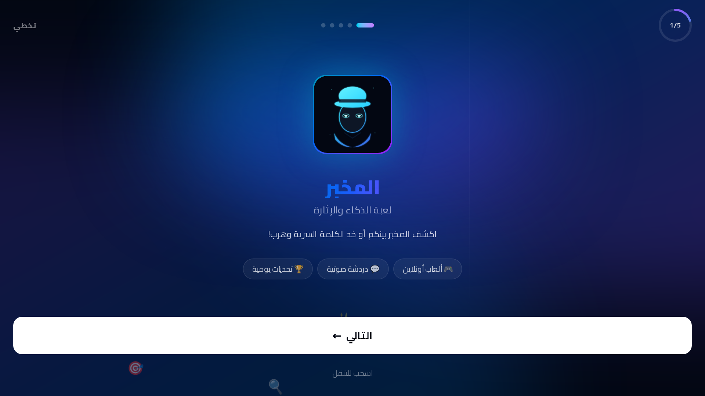

# 🕵️ المخبر | Elmokhber

[](LICENSE.md)
[]()
[](https://elmokhber.vercel.app)

> Social deduction game of intelligence, strategy & deception
> لعبة اجتماعية تفاعلية تعتمد على الذكاء والخداع الاستراتيجي



---

## 🌐 English

### Features

- 🕵️ **Hidden & diverse roles** — Varied secret roles for players
- 🎙️ **Live voice calls** — Direct voice communication via LiveKit
- 🏠 **Multiplayer game rooms** — Play with friends in private rooms
- ⚡ **Real-time gameplay** — Instant and direct gameplay experience
- 🎨 **Modern & attractive design** — Elegant and modern interface
- 📱 **Fully responsive** — Works on all devices
- 🌙 **Dark/Light mode** — Choose your preferred theme
- 🧠 **Diverse strategies** — Multiple and varied gameplay tactics

### Technologies

- Next.js, TypeScript, Tailwind CSS, shadcn/ui, LiveKit, Prisma, Framer Motion, Vercel

### Installation

```bash
git clone https://github.com/ziadamr45/Elmokhber.git
cd Elmokhber
npm install
# Set up .env from .env.example with LiveKit and database configuration
npx prisma migrate dev
npm run dev
```

### How to Play

1. **Create or join a room** — Share the room code with friends
2. **Role assignment** — Each player receives a secret role
3. **Game starts** — Discuss and discover who the traitor is
4. **Voting** — Vote to eliminate suspects
5. **Win** — The team that discovers the traitor first wins!

### Live Demo

[elmokhber.vercel.app](https://elmokhber.vercel.app)

### License

This project uses [Source Available License](LICENSE.md) — © 2026 Ziad Amr

---

## 🇪🇬 العربية

### المميزات

- 🕵️ **أدوار مخفية ومتعددة** — أدوار سرية متنوعة للاعبين
- 🎙️ **مكالمات صوتية مباشرة** — تواصل صوتي مباشر عبر LiveKit
- 🏠 **غرف لعب متعددة اللاعبين** — العب مع أصدقائك في غرف خاصة
- ⚡ **لعب في الوقت الحقيقي** — تجربة لعب فورية ومباشرة
- 🎨 **تصميم عصري وجذاب** — واجهة أنيقة وحديثة
- 📱 **متجاوب بالكامل** — يعمل على جميع الأجهزة
- 🌙 **وضع داكن/فاتح** — اختر المظهر المناسب لك
- 🧠 **استراتيجيات متنوعة** — تكتيكات لعب متعددة ومتنوعة

### التقنيات

- Next.js، TypeScript، Tailwind CSS، shadcn/ui، LiveKit، Prisma، Framer Motion، Vercel

### التثبيت

```bash
git clone https://github.com/ziadamr45/Elmokhber.git
cd Elmokhber
npm install
# إعداد .env من .env.example بإعدادات LiveKit وقاعدة البيانات
npx prisma migrate dev
npm run dev
```

### طريقة اللعب

1. **إنشاء غرفة أو الانضمام لواحدة** — شارك كود الغرفة مع أصدقائك
2. **توزيع الأدوار** — كل لاعب يحصل على دور سري
3. **بدء اللعبة** — ناقشوا واكتشفوا من هو الخائن
4. **التصويت** — صوّتوا لطرد المشتبه بهم
5. **الفوز** — الفريق الذي يكتشف الخائن أولاً يفوز!

### تجربة مباشرة

[elmokhber.vercel.app](https://elmokhber.vercel.app)

### الرخصة

هذا المشروع يستخدم [رخصة عرض المصدر](LICENSE.md) — © 2026 زياد عمرو

---

## Developer | المطور

**Ziad Amr** (زياد عمرو)

- 🌐 Portfolio: [ziadamrme.vercel.app](https://ziadamrme.vercel.app)
- 💼 GitHub: [github.com/ziadamr45](https://github.com/ziadamr45)
- 📘 Facebook: [facebook.com/ziad7mr](https://www.facebook.com/ziad7mr)
- 💬 Telegram: [t.me/ziadamr](https://t.me/ziadamr)
- 📸 Instagram: [instagram.com/ziadamr455](https://www.instagram.com/ziadamr455/)
- 🧵 Threads: [threads.com/@ziadamr455](https://www.threads.com/@ziadamr455)
- 🐦 X (Twitter): [x.com/ziad90216](https://x.com/ziad90216)
- 🎥 YouTube: [youtube.com/@alhayat_ala_eltarek](https://youtube.com/@alhayat_ala_eltarek)
- 💼 LinkedIn: [linkedin.com/in/ziad-amr-44633a411](https://www.linkedin.com/in/ziad-amr-44633a411)
- 📧 Email: ziad90216@gmail.com

---
<p align="center">
  Powered by <a href="https://github.com/ziadamr45">Ziad Amr</a>
</p>
